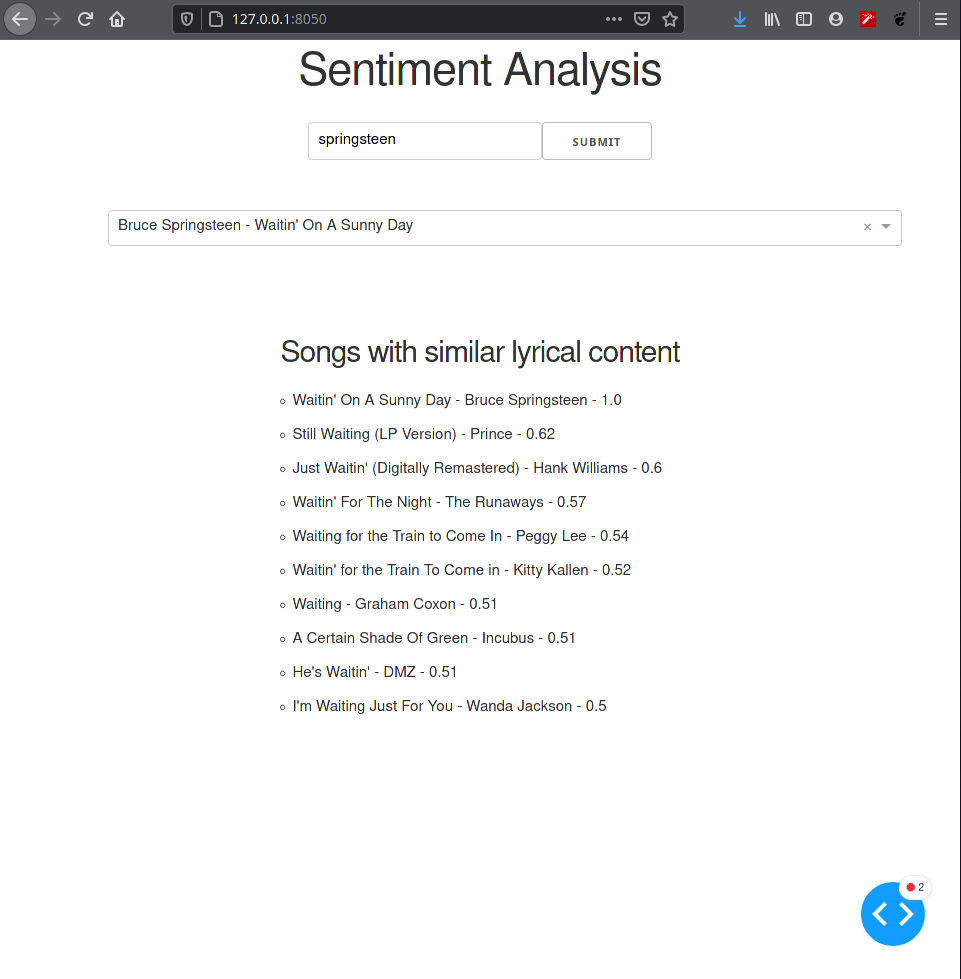

# Song Recommendation Engine

Small Dash app that will recommend songs based on lyric similarity. Data bag of word data from the million song database was used (roughly 230000 songs). This was converted to TF-IDF vectors and the recommendation engine returns the top 10 songs with the highest cosine similarity. The dataset can be found at [musiXmatch](http://millionsongdataset.com/musixmatch/) and the numpy arrays created to run the app can be found here:
* [TF-IDF vector for every song](https://drive.google.com/file/d/1-MhAXEMCmeUpa0xwJ0uojAkbvHANPWQ_/view?usp=sharing)
* [Track lyric word mappings](https://drive.google.com/file/d/1my70wn1cHW4APGObziprsX6DuD34HnKH/view?usp=sharing)
* [Word index mappings](https://drive.google.com/file/d/1h61mA7MRLZ2u9jZy1B0J7Us5ryUl1luY/view?usp=sharing)

## Screenshot
Songs similar to "Waitin' on a Sunny Day" by The Boss

## To do
* The app is quite slow without a fast processor therefore I plan to move it to a distributed file system to speed up computation
